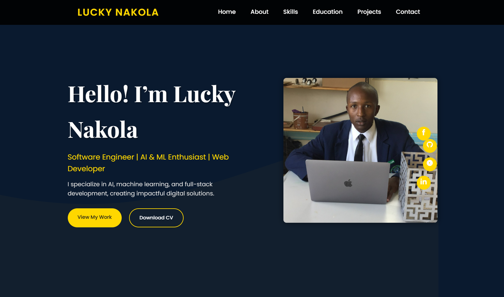

<div align="center">

# ⚡ Lucky Nakola — Developer Portfolio

**Tier-1 multi-page developer showcase built with modern web standards**



[](LICENSE)
[](#-site-map)
[](#-tech-stack)
[](#-tech-stack)
[](#-tech-stack)

[**Live Site →**](https://waiyah.github.io/MY-PORTFOLIO/) · [Report Bug](https://github.com/WAIYAH/MY-PORTFOLIO/issues) · [Request Feature](https://github.com/WAIYAH/MY-PORTFOLIO/issues)

</div>

---

## 👋 About

I'm **Lucky Nakola**, a Software Engineer & AI Innovator based in Nairobi, Kenya. This portfolio is a multi-page showcase of my work, skills, and professional journey — designed to command attention from recruiters and engineering leads.

The site follows a **"Confident Futurism"** dark theme with a cyan/violet gradient accent system, built entirely with semantic HTML5, Tailwind CSS, and vanilla JavaScript — no frameworks, no build tools, zero dependencies.

## ✨ Features

| Feature | Details |
|---|---|
| **Multi-Page Architecture** | 9 purpose-built pages with consistent navigation |
| **Design System** | CSS custom properties, reusable components, 4 badge variants |
| **Scroll Animations** | IntersectionObserver-powered reveal effects (fade, slide, scale) |
| **Interactive Elements** | Typing effect, animated counters, skill progress bars, project filters |
| **CV Microsite** | Interactive view, print-optimized A4 layout, PDF download hub |
| **Contact Form** | Client-side validation, subject/budget selectors, FAQ accordion |
| **Responsive** | Mobile-first with hamburger menu, tested across breakpoints |
| **Accessible** | WCAG 2.1 AA — ARIA labels, focus-visible, reduced-motion support |
| **SEO Ready** | Semantic HTML, meta descriptions, sitemap.xml, robots.txt |
| **Performance** | Lazy loading images, font-display: swap, minimal DOM operations |

## 🗺️ Site Map

```
index.html          → Hero landing with typing effect & featured projects
about.html          → Professional narrative, timeline, interests
expertise.html      → Skills matrix, tools grid, methodology
projects.html       → Filterable project showcase (10 projects, 4 categories)
insights.html       → Technical perspectives & thought leadership
services.html       → Services & pricing, cost estimator, process timeline
contact.html        → Contact form, FAQ, social links, availability
cv/view.html        → Interactive two-column resume
cv/print.html       → Print-optimized A4 resume
cv/download.html    → Download hub (PDF + print)
404.html            → Custom error page
```

## 📁 Project Structure

```
MY-PORTFOLIO/
├── css/
│   └── styles.css           # Design system — tokens, components, animations
├── js/
│   └── app.js               # Interaction engine — 16 modules (IIFE)
├── cv/
│   ├── view.html            # Interactive resume
│   ├── print.html           # Print-optimized resume
│   └── download.html        # Download hub
├── docs/
│   └── ARCHITECTURE_BLUEPRINT.md
├── img/                     # Project screenshots & profile photo
├── pdf/
│   └── LUCKY NAKOLA CV.pdf  # Downloadable CV
├── index.html               # Home / hero page
├── about.html               # About page
├── expertise.html           # Skills & expertise page
├── projects.html            # Projects showcase
├── insights.html            # Blog / insights page
├── services.html            # Services & pricing page
├── contact.html             # Contact page
├── 404.html                 # Custom 404 page
├── sitemap.xml              # SEO sitemap
├── robots.txt               # Crawler directives
├── .gitignore               # Git ignore rules
├── .editorconfig            # Editor consistency
├── CONTRIBUTING.md          # Contribution guidelines
├── LICENSE                  # MIT License
└── README.md                # This file
```

## 🛠️ Tech Stack

| Layer | Technology |
|---|---|
| **Markup** | HTML5 (semantic, accessible) |
| **Styling** | [Tailwind CSS](https://tailwindcss.com/) (CDN) + Custom CSS design system |
| **Interactivity** | Vanilla JavaScript ES6+ (no frameworks) |
| **Typography** | [Inter](https://rsms.me/inter/) · [Space Grotesk](https://fonts.google.com/specimen/Space+Grotesk) · [JetBrains Mono](https://www.jetbrains.com/lp/mono/) |
| **Icons** | Inline SVG (Heroicons style) |
| **Hosting** | GitHub Pages |

## 🎨 Design System

The visual identity is built on CSS custom properties defined in `css/styles.css`:

```
Background:   #030712 (base) → #0f172a (surface) → #1e293b (elevated)
Accent:       #06b6d4 (cyan-500)
Gradient:     135deg → cyan-500 → violet-500
Gold:         #eab308 (highlights)
```

**Components:** Buttons (primary / secondary / gold) · Cards · Badges (4 variants) · Timeline · Skill bars · Form inputs · Section headings · Scroll reveal classes

## 🚀 Getting Started

No build tools required — just clone and open.

```bash
# Clone the repo
git clone https://github.com/WAIYAH/MY-PORTFOLIO.git

# Open in browser
cd MY-PORTFOLIO
start index.html        # Windows
open index.html         # macOS
xdg-open index.html     # Linux
```

**Or use VS Code Live Server:**

1. Open the folder in VS Code
2. Install the [Live Server](https://marketplace.visualstudio.com/items?itemName=ritwickdey.LiveServer) extension
3. Right-click `index.html` → **Open with Live Server**

## 🤝 Contributing

Feedback and suggestions are welcome! See [CONTRIBUTING.md](CONTRIBUTING.md) for guidelines.

## 📄 License

Distributed under the **MIT License**. See [LICENSE](LICENSE) for details.

## 📬 Contact

| Channel | Link |
|---|---|
| **Email** | [luckiesdabwoy@gmail.com](mailto:luckiesdabwoy@gmail.com) |
| **LinkedIn** | [Lucky Nakola](https://www.linkedin.com/in/lucky-nakola-a09633250/) |
| **GitHub** | [@WAIYAH](https://github.com/WAIYAH) |
| **WhatsApp** | [+254 715 674 828](https://wa.me/254715674828) |
| **Location** | Nairobi, Kenya 🇰🇪 |

---

<div align="center">
  <p><strong>Built with 💙 by Lucky Nakola</strong></p>
  <p><sub>© 2026 — All rights reserved</sub></p>
</div>
